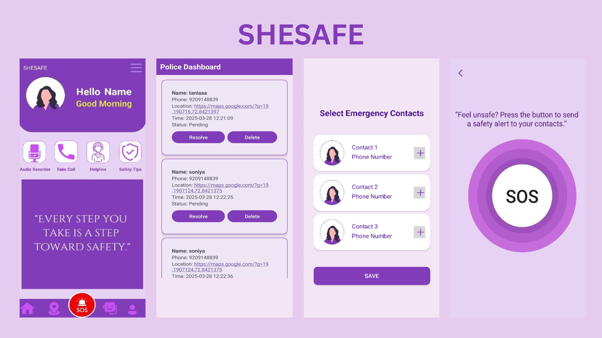

# SheSafe - Women's Safety App 

## An Android app designed to help women stay safe by connecting them to trusted contacts and police.

#### SheSafe is an Android-based mobile application created to improve women's safety by offering essential emergency features in one place. The app is designed to be user-friendly and effective in situations where immediate help is needed. With the rise in safety concerns, especially when women are alone or in unfamiliar places, SheSafe serves as a powerful tool to connect them with their trusted contacts and law enforcement.

## App Screenshots

##  SheSafe – App Features
###
 **Login for Users & Police**
   Secure login options for regular users and police officers.

 **SOS Alert Button**
   Sends an emergency message with location to saved contacts and nearby police.

 **Emergency Contact Picker**
   Add and manage emergency contacts with ease.

 **Location Sharing**
   Send your location to selected emergency contacts anytime.

 **Fake Call Feature**
   Receive a fake call with ringtone to escape uncomfortable situations.

 **Audio Recording**
   Quickly record and save audio for evidence or safety.

 **Self-defense Guide**
   Learn basic techniques and how to use daily objects for protection.

 **Chatbot Assistant**
   Get help and tips instantly from an in-app virtual assistant.

 **Police Dashboard**
    Police can view SOS cases, user info, and mark cases as resolved.

 **App Settings**
    Change password, language, and give feedback in one place.

 **Helpline Numbers**
    One-tap access to national and local safety helplines.
